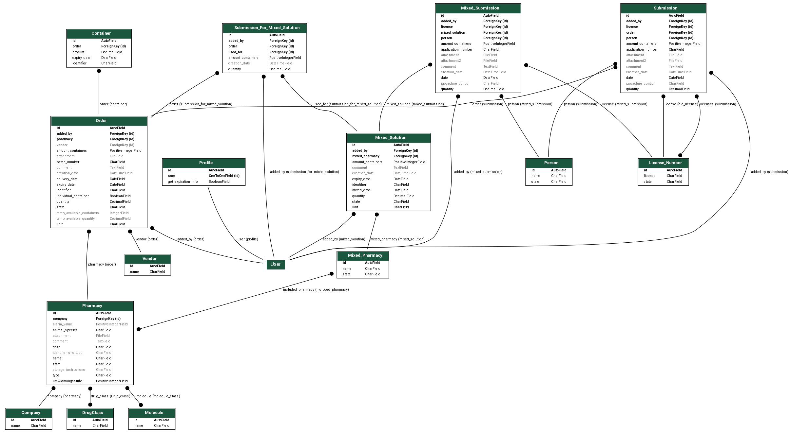

**Welcome to the documentation of pharmacy !**

Introduction
============

**pharmacy** is a webservice for research institutes to manage there
pharmacy stock and the submissions to the animal caretakers.

It has been developed at the [Leibniz institute for aging
research](http://www.leibniz-fli.de) in Jena. This django app is meant
to be used by Veterinarians who are responsible for the pharmacy. The
system should help documentation and to have a quick overview over the
pharmacy stock.

Contact
=======

Technical and application support: Fabian Monheim (CF Life Science
Computing), <fabian.monheim@leibniz-fli.de>, 03641-65-6872

Content support: Animal Facility and Animal Welfare Officer

License
=======

The software was developed at the Leibniz Institute on Aging - Fritz
Lipmann Institute (FLI; <http://www.leibniz-fli.de/>) under a mixed
licensing model. Researchers at academic and non-profit organizations
can use pharmacy using the included license, while for-profit
organizations are required to purchase a license. By downloading the
package you agree with conditions of the FLI Software License Agreement
for Academic Non-commercial Research (LICENSE.pdf).

Installation
=======

The webapp uses the Django framework as base.  

With 
    `pip install -r requirements.txt `
you install all dependencies.

Copy the pharmacy/template_local_settings.py to pharmacy/local_settings.py and edit this file to your needs. Set the SECRET_KEY for your database.
To prepare the database run the commands:
`python manage.py migrate ` 
`python manage.py makemigrations`
`python manage.py migrate `

Create the superuser to login the first time
`python manage.py createsuperuser`

Finally
`python manage.py collectstatic` collects all static files like css, javascript and so far.
`python manage.py runserver` starts serving the app.

You will find how to deploy a Django app with a webserver at [https://docs.djangoproject.com/en/3.2/howto/deployment/](https://docs.djangoproject.com/en/3.2/howto/deployment/)

Sitemap
=======

-   Start: <http://pharmacy.leibniz-fli.de>
-   Full overview: <http://pharmacy.leibniz-fli.de/all>
-   Passwort change:
    <http://pharmacy.leibniz-fli.de/accounts/password_change/>
-   Changelog:
    <http://pharmacy.leibniz-fli.de/changes>

Main user interface
===================

Overview
--------

The home page shows the stock which is currently available.

It is possible to export the available stock as .csv file using the
Button `Options` and `Export`. Furthermore it\'s possible to export all
submissions within a period of time using the button `Export advanced`.

Use the link of the pharmacy name column to see all submissions
belonging to a pharmacy (ignoring a a single order) The `more` link
(last coloumn) shows all orders concerning the pharmacy. To create a
submissions you can use the `submit` link (second last coloumn). If
there are containers from several orders available the user has to
select an order from which the pharmacy is taken.

Full Overview
-------------

The full overview shows also pharmacy which isn\'t available

Entities
========

Persons
-------

[Persons](http://pharmacy.leibniz-fli.de/admin/pharmadoc/person/).
Persons are members of the institute and can apply for a pharmacy

Pharmacy
--------

[Pharmacy](http://pharmacy.leibniz-fli.de/admin/pharmadoc/pharmacy/).
The pharmacy is the medicine. The name is composed of the name of the
pharmacy and the dose of the active molecule. It's possible to set an "alarm value" for a pharmacy. If this value is set, the "Admin"  receives a mail, if the containers in stock is less then this value for this pharmacy. The available stock of a pharmacy is calculated from all active orders belonging to the pharmacy. The unit of a pharmacy (e.g. gram, milligram, milliliters) is a calculated field from the orders. Ever order has to be the same unit. If not the unit of the pharmacy is false. This is obviously impractical but has not yet led to problems. 

Order
-----

[Order](http://pharmacy.leibniz-fli.de/admin/pharmadoc/order/).
An Order increase the stock of a pharmacy. Every order gets an
identifier from the system. The identifier is composed of the first
three letters of the name of the pharmacy or if set the "identifier shortcut" of the pharmacy and the delivery date. If
there is already an order with the designated identifier the new
identifier gets a ongoing number as last character. Every order belongs
to a pharmacy and have a state `active` or `deactivated`. It turns
automatically to `deactivated` if all containers are submitted. In case
of reaching the expiry date or something else the status can be set
manually. It isn\'t possible to create a new submissions from a order
which is set to `deactivated`.

Company
-------

[Company](http://pharmacy.leibniz-fli.de/admin/pharmadoc/company/).
A Company is the manufacturer of the pharmacy.

Drug class
----------

[Drug
class](http://pharmacy.scinet.fli-leibniz.de/admin/pharmadoc/drugclass/).
The drug class helps to classify the pharmacy into several groups like
`Antibiotika` or `Anästhetikum`

Molecules
---------

[Molecule](http://pharmacy.leibniz-fli.de/admin/pharmadoc/molecule/).
The molecule is the active substance of a pharmacy

Submission
--------
This is the delivery (part) of an order to the end user. A submission has the value "amount containers" and "quantity". Both values are detached from each other. It's possible to submit two containers and null quantity. The value quantity should be used when submitting a part of a container.  

Mixed Pharmacy
--------
The mixed pharmacy entity is the recipe for a mixed solution. IT defines which pharmacy must be used to create a solution.

Mixed Solution
--------
The mixed solution is the equivalent to the order. It is the entity which can submit to the end user. To create a mixed solution the user has to select a mixed pharamacy and the system checks all available orders belonging to the pharmacies. The user select the orders wich will be used for the mixed solution and enter the quantity which will be used for it.

Mixed Submission
--------
